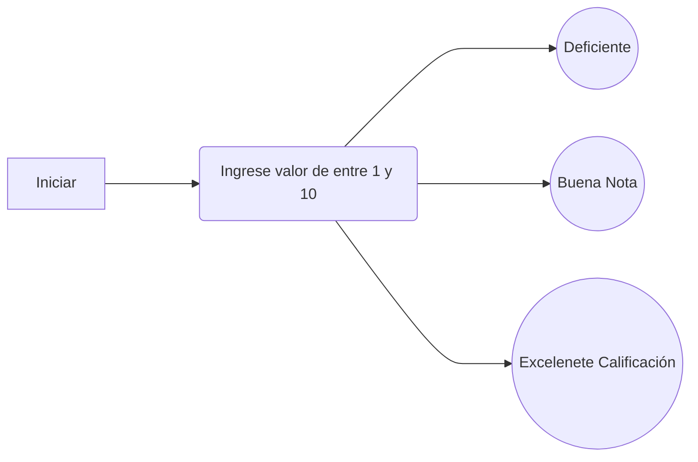

#                                       **🤞😬 **

#  # Un simple programa de prácticas, que valida el nivel de su calificación entre 0 y 10. Un programa muy simple!

## html,css y javacript

```mermaid
graph LR
A[Iniciar] ---> B( Ingrese valor de entre 1 y 10 )
B ---> D((Deficiente))
B ---> E((Buena Nota))
B ---> F((Excelenete Calificación))

```
